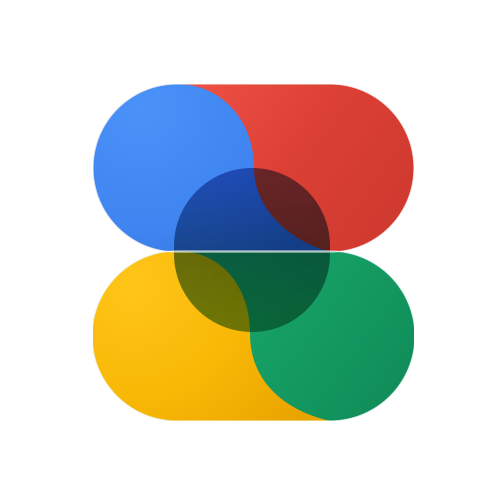

# Material Design Development Guide

> Comprehensive documentation for the Material Design.

**Project:** 2.0.5 | **Last Updated:** 2026-07-31

---

## Table of Contents

- [Repository Contract](#repository-contract)
- [Product-Surface Material Design Contract](#product-surface-material-design-contract)
- [Platform Versions and Published URLs](#platform-versions-and-published-urls)
- [Component Lifecycle](#component-lifecycle)
- [Android Development](#android-development)
- [Material Web Development](#material-web-development)
- [HTML Documentation and Skills](#html-documentation-and-skills)
- [Web Showcase Architecture](#web-showcase-architecture)
- [Project Structure](#project-structure)
- [Key Components](#key-components)
- [Configuration](#configuration)
- [Web Showcase Contribution Reference](#web-showcase-contribution-reference)

---

## Repository Contract

- `material-app/` is the leading Material Design implementation while components are being refined.
- `material-web/` is the independent Material Web workspace. It translates accepted UI/UX into vanilla HTML, CSS, and JavaScript without sharing Android implementation code.
- `docs/material-web-legacy/` is the responsive 1.5.0 browser showcase. Keep its established behavior coherent and make showcase-specific changes deliberately.
- `docs/` is the complete GitHub Pages publishing root and contains the responsive learning and project documentation.
- `docs/skills/android/` and `docs/skills/web/` contain browsable HTML guidance.
- `skills/android/` and `skills/web/` contain the Markdown counterparts for agents and development harnesses.
- Published web media belongs in `docs/assets/`; compiled Android resources remain under the Android module's `res/` tree.
- Project Markdown is kept at the repository root, including the dedicated `skills/` tree.

Android and web share only UI/UX intent: appearance, states, terminology, interaction purpose, and equivalent adaptive behaviour. Their implementation code, tokens, APIs, state management, testing, and releases remain independent.

---

## Product-Surface Material Design Contract

The Android app, documentation website, and Material Web implementation must **use Material Design as complete products**, not merely display isolated Material components inside generic surrounding interfaces. Their application shells, navigation, ordinary actions, typography, layout, containers, states, feedback, motion, accessibility, and adaptive behaviour are part of the reference.

> [!IMPORTANT]
> A technically accurate component showcase inside a visually generic or inconsistent product is a failed implementation. For example, demonstrating an excellent split button does not count as success if the app or website itself uses generic fallback buttons, weak hierarchy, arbitrary spacing, or unrelated interaction patterns for its real navigation and actions.

Apply these rules to every active surface:

- **Dogfood the system.** When a component becomes suitable for real use, use it where its interaction purpose fits the app or website. Do not confine the best Material work to demo cards while the surrounding product remains generic.
- **Design the whole journey.** Launcher and landing screens, app bars, navigation, search, settings, detail pages, dialogs, loading, empty, error, disabled, focus, hover, pressed, and completion states must belong to one coherent Material system.
- **Use components by purpose.** Dogfooding does not mean placing expressive components everywhere. Choose components according to hierarchy, frequency, consequence, platform convention, available space, and accessibility.
- **Share quality, not implementation.** Android, documentation, and Material Web code remain independent, but each surface must achieve the same level of deliberate Material UI/UX using platform-appropriate engineering.
- **Treat generic UI as unfinished.** Temporary platform defaults or placeholder styling are acceptable during development only when clearly treated as in development. They must be replaced or deliberately justified before the affected surface is considered ready.
- **Review the host surface with the demo.** Component review must evaluate both the focused example and the product UI used to reach, configure, understand, and leave that example.

The `docs/material-web-legacy/` showcase is a self-contained browser reference with its own established design system and contribution boundaries.

---

## Platform Versions and Published URLs

| Surface | Current version | Published location |
|---------|-----------------|--------------------|
| Android app | 2.0.5, active | [GitHub Releases for APK downloads](https://github.com/qtremors/material-design/releases) |
| Web documentation | 2.0.5 | [https://qtremors.github.io/material-design/](https://qtremors.github.io/material-design/) |
| Web showcase | 1.5.0 | [https://qtremors.github.io/material-design/material-web-legacy/](https://qtremors.github.io/material-design/material-web-legacy/) |
| Material Web workspace | Independent | [Published project route](https://qtremors.github.io/material-design/material-web/) |

The documentation site is the guidance entry point, the 1.5.0 site is the responsive browser component showcase, and `material-web/` provides an independent implementation workspace with its own public project route.

---

## Component Lifecycle

1. Implement a state-hoisted component or official API usage in the matching `material-app/samples/` domain module.
2. Add its working demo registration, official name, aliases, API maturity, source path, purpose, use and avoid rules, behavior, accessibility, and adaptive guidance to the validated catalog.
3. Verify guidance search, interactive behavior, accessibility, and adaptive layouts before exposing it in the app.
4. Track unfinished components only in `TASKS.md`; never add placeholder cards to the installed catalog.
5. Add an independent web counterpart after the Android reference has stabilized.

---

## Android Development

Material Design is a Kotlin and Jetpack Compose component gallery whose repository source is the implementation reference. `material-app/app/` owns only bootstrap, typed navigation, the adaptive shell, and dependency composition. `core/` owns the validated offline catalog, deterministic search, DataStore preferences, and design system; `feature/` owns product surfaces; `samples/` owns state-hoisted implementations grouped by official Material domains. The Gradle version catalog remains the dependency source of truth.

The bundled JSON catalog records only working entries. It distinguishes API availability (stable artifact or alpha-only) from API stability (stable or experimental), and its tests require exact dependency-version alignment, existing source paths, unique canonical names, complete development guidance, and registered demos. Guidance is part of the product contract: every entry explains purpose, appropriate and inappropriate use, expected behavior, accessibility, and adaptive layout decisions.

```powershell
cd material-app
.\gradlew.bat testDebugUnitTest assembleDebug
```

Preserve the `Material Design` application label, namespace/application ID `dev.qtremors.materialdesign`, public version `2.0.5`, and Android assets. Use official component names in UI and catalog metadata; older project terms belong only in aliases when useful for search. Detailed Android references are linked from the [documentation skill index](https://qtremors.github.io/material-design/#skills).

### Android motion contract

All explicit app-shell and project-reference spring values must use `core/designsystem/ExpressiveMotion.kt`; do not scatter replacement constants through feature or sample modules. The shell themes through `MaterialExpressiveTheme` with the official expressive `MotionScheme`; reduced motion swaps the whole scheme to snap-based specs resolved by `ExpressiveMotion.motionScheme(reducedMotion)`. Do not normalize every transition to one spring: the inherited compact navigation deliberately combines a low-bouncy icon lift and label slide with Material's default toolbar-size, fade, expand, collapse, and exit behavior. The wider motion language distinguishes medium-bouncy press feedback, low-bouncy navigation and fluid layout changes, no-bounce shape/state settling, high-stiffness progress smoothing, and short high-stiffness rejected-action feedback. Pressed content scales to `0.94`, the selected compact-navigation icon lifts `12.dp`, hold confirmation lasts 1.5 seconds, and the loading reference lasts 1.2 seconds.

Reduced motion snaps decorative spatial and opacity transitions to their target while preserving interaction meaning, state changes, and safety timing such as hold-to-confirm. Animation code must tolerate interruption, rapid repeated input, disposal, disabled-state changes, and a duration of zero or less without leaving stale progress, jobs, selection, or transformed content. Official carousels, progress indicators, toolbars, and navigation components retain their own Material physics; project motion may augment their state feedback without replacing platform behavior.

---

## Material Web Development

The Material Web implementation remains framework-free unless explicitly changed. Use semantic HTML, modern CSS, and vanilla JavaScript, and do not copy Compose code or Android architecture into browser components.

Every active HTML page must support narrow phones, tablets, resizable desktop windows, large displays, browser zoom, long text, keyboard interaction, visible focus, and reduced motion. Wide tables and code samples may scroll within their own containers; they must never widen the page itself.

Do not begin a component merely because an Android in-development example exists. Use `TASKS.md` and `docs/parity.html` as the readiness contract.

---

## HTML Documentation and Skills

Serve the GitHub Pages source directory so local URLs match production:

```powershell
cd docs
python -m http.server 8000
```

Open `http://localhost:8000/`. Published documentation, HTML skills, shared web assets, the Material Web route, and the browser showcase all live beneath `docs/`, so no published page depends on local files outside the Pages root. Agent-oriented Markdown skills live under the root `skills/` tree and are linked through GitHub. Keep each HTML skill aligned with its Markdown counterpart when the component or development contract changes.

---

## Web Showcase Architecture

The responsive **Material Design** showcase under `docs/material-web-legacy/` is a **Static Web Application** with no compile step. It follows a component-based architecture where HTML files represent views, and shared logic is injected or imported. Paths in this section are relative to `docs/material-web-legacy/`.

> [!IMPORTANT]
> The browser showcase is mobile compatible and keeps its own framework-free architecture. Treat the remaining sections as its focused contribution reference.

```
┌──────────────────────────────────────────────────────────────┐
│                         HTML Pages                           │
│              (index.html, buttons.html, etc.)                │
└──────────────────────────────────────────────────────────────┘
                              │
                              ▼
┌──────────────────────────────────────────────────────────────┐
│                    JavaScript Modules                        │
│ (Orchestrator, Global Interactions, Theme Engine, Ripples)   │
└──────────────────────────────────────────────────────────────┘
                              │
                              ▼
┌──────────────────────────────────────────────────────────────┐
│                       CSS System                             │
│          (Variables, Design Tokens, Component Styles)        │
└──────────────────────────────────────────────────────────────┘
```

### Key Design Decisions

| Decision | Rationale |
|----------|-----------|
| **Zero Dependencies** | Ensures maximum performance, easy learning curve, and no build toolchain required. |
| **CSS Variables** | Allows for dynamic theming (Light/Dark, Color Seeds) without SASS/LESS preprocessors. |
| **Vanilla JS** | Removes framework overhead; ideal for understanding the underlying mechanics of components. |

---

## Project Structure

```
├── src/                  # Source code
│   ├── assets/           # Static images/icons
│   │   └── material-design.svg # Branding Logo (Transparent)
│   ├── css/
│   │   ├── components/       # Component-specific styles
│   │   │   ├── buttons.css
│   │   │   ├── cards.css
│   │   │   ├── inputs.css
│   │   │   └── ...
│   │   ├── base.css          # Core foundations (Reset, Typography)
│   │   ├── variables.css     # Design tokens (colors, type, elevation)
│   │   └── widgets/          # Widget-specific styles
│   │       ├── structure.css
│   │       ├── music.css
│   │       └── ...
│   ├── js/
│   │   ├── components/       # Component logic
│   │   │   ├── interactions.js   # Global Event Delegation
│   │   │   ├── ripples.js
│   │   │   ├── widgets.js
│   │   │   └── ...
│   │   ├── theme.js          # Theme abstraction and persistence
│   │   ├── navigation.js     # Navigation Rail/Drawer injection
│   │   └── scripts.js        # Main entry point / Orchestrator
│   ├── buttons.html          # Component pages
│   ├── cards.html
│   ├── ...
├── index.html            # Entry point
├── README.md             # User-facing documentation
├── DEVELOPMENT.md        # This file
├── CHANGELOG.md          # Version history
└── TASKS.md              # Task tracking
```

---

## Key Components

### Theme Engine (`src/js/theme.js`)

Manages the application state for Theme (Light/Dark/OLED) and Color Seeds.

-   **Persistence:** Uses `localStorage` and `window.name` (for session sync).
-   **Application:** Sets `data-theme` (light/dark/oled) and `data-seed` attributes on the `<html>` element.

| Method/Function | Description |
|-----------------|-------------|
| `ThemeEngine.init()` | Loads state and applies it immediately to prevent flash. |
| `ThemeEngine.load()` | Retrieves state from storage or window.name. |
| `ThemeEngine.apply()` | Updates DOM attributes based on current state. |

Injects the Navigation Rail (desktop) and Drawer (mobile) into the DOM.

> [!NOTE]
> The **Top App Bar** (Header) is currently **static** inside each HTML file to allow for page-specific titles and actions. It is NOT dynamically injected.

| Method/Function | Description |
|-----------------|-------------|
| `renderNavigation()` | Generates HTML for nav rail/drawer and appends to `body`. |

### Global Interactions (`src/js/components/interactions.js`)

**CRITICAL:** This file handles 90% of the application's interactivity via **Event Delegation**. Instead of attaching listeners to individual elements, a global listener captures clicks on elements with `data-action` attributes.

#### Common Data Actions:
- `data-action="toggle-loading"`: Toggles loading state on buttons.
- `data-action="open-dialog"` / `data-action="close-dialog"`: Manages dialog visibility.
- `data-action="segment-pick"`: Handles segmented button selection.
- `data-action="morph"`: Triggers FAB morphing animations.

### Ripples (`src/js/components/ripples.js`)

Custom implementation of the material ink ripple.

| Method/Function | Description |
|-----------------|-------------|
| `initRipples()` | Attaches global click listener for `.ripple-target` elements. |
| `createRipple(e, el)` | Calculates exact position and animates the ripple span. |

### Playground (`src/js/components/playground.js`)

A developer tool for auditing the design system and testing themes.

- **Dual-Pane Layout**:
    - **Live Preview ('Lab')**: Real-time rendering of buttons, cards, and inputs to test the current seed/theme.
    - **Full Matrix**: A searchable grid of *all* 300+ CSS variables derived from the current seed.
- **Deep Inspection**: Clicking any color token in the Matrix copies its hex code. Clicking the token name copies the variable name (e.g., `--md-sys-color-primary`).
- **Color Naming Engine**: Integrated logic (based on `ntc.js`) to provide human-readable names for every generated color.


---

## Technical Standards & Strict Compliance

All new additions to this library **must** strictly adhere to the following Material Design specifications to maintain a cohesive "feel" and behavior.

### 1. Design Systems & Guidelines
-   **Google Material Design 3 (MD3):** All components **MUST** strictly follow the official [Material Design 3 Guidelines](https://m3.material.io/). This includes layout, spacing, typography, and interaction states.
-   **Material You (Dynamic Color):** All components **MUST** be fully themeable. They must react immediately to `data-seed` changes and support both Light and Dark modes without exception.
-   **Material 3 Expressive:** Adopt "Expressive" traits for high-impact components. Use rounder shapes, playful animations, and unique layouts as defined in the [MD3 Expressive Guidelines](https://m3.material.io/styles/motion/overview).

### 2. Animations & Effects
-   **Duration & Easing:** Use MD3 standard durations (200ms-400ms) and easing functions (standard, emphasized).
-   **Ripples:** Every interactive element must have a ripple effect using the `.ripple-target` class.
-   **Expressive Motion:** For complex transitions (e.g., shape morphing), use `cubic-bezier(0.175, 0.885, 0.32, 1.275)` for a bouncy, elastic feel.

### 3. Theme & Feel
-   **NO HARDCODED COLORS:** Usage of hex codes (e.g., `#FFFFFF`, `#000`) or named colors (e.g., `white`, `black`) is **STRICTLY PROHIBITED** in component styles. You **MUST** always use `--md-sys-color-*` tokens to ensure proper dynamic theming.
-   **State Layers:** Use standard state layer opacities (`.08` for hover, `.12` for pressed) via CSS variables.
-   **Naming:** Follow the MD3 naming schema for variables and classes (e.g., `surface-container-high`, `on-primary-container`).

---

## How to Create New Components

### 1. Create the HTML Page
Create a new file (e.g., `my-component.html`) in the **src/** directory.
> **Tip:** Copy `src/buttons.html` or `src/cards.html` to use as a template. This ensures you have the correct `<head>` logic, viewport meta tags, header branding, and script imports.

### 2. Include the Header Branding
Every page must have a `top-app-bar` with the branding logo linking to the dashboard:

```html
<div class="top-app-bar">
    <a href="../index.html" class="header-logo ripple-target" title="Home">
        
    </a>
    <h2>My Component</h2>
    <div style="flex: 1"></div>
</div>
```
*(Paths assume the file is in `src/`. Adjust if placed elsewhere)*

### 3. Add Styles
Create a new CSS file in `src/css/components/` (e.g., `my-component.css`) and link it in your HTML file.
-   **Strictly use CSS variables** from `src/css/variables.css` for colors (`--md-sys-color-*`), typography (`--md-sys-typescale-*`), and shapes.
-   Do not hardcode hex values or pixel sizes unless absolutely necessary.

### 3. Register Navigation
To make your new page accessible, you must register it in **two places**:

#### A. Navigation Rail & Drawer (`src/js/navigation.js`)
Add a new object to the `NAV_ITEMS` array:
```javascript
const NAV_ITEMS = [
    // ... existing items
    { label: 'New Component', icon: 'extension', url: 'my-component.html' } // Use a valid Material Symbol name for the icon
];
```

#### B. Dashboard Index (`index.html`)
Add a new card to the `.dashboard-grid` container:
```html
<a href="my-component.html" class="md-card nav-card ripple-target">
    <span class="material-symbols-rounded nav-card-icon">extension</span>
    <h3>New Component</h3>
    <p>A brief description of the component.</p>
</a>
```

### 4. Create New Widgets
Widgets are specialized components used in the grid layout (`widgets.html`).

#### A. Structure (`src/widgets.html`)
- **Wrapper**: specific ID + `widget-wrapper` + size class (e.g., `w-2x2`, `w-4x2`).
- **Heading**: `<h3>` with title and `<span class="grid-label">` for size.
- **Content**: A container (often `.md-card`) holding the widget UI.

```html
<!-- Example Widget -->
<div id="widget-example" class="widget-wrapper w-2x2">
    <h3>Title <span class="grid-label">2x2</span></h3>
    <div class="md-card card-filled">
        <!-- Widget Content -->
    </div>
</div>
```

#### B. Styles (`src/css/widgets/`)
-   **Modular CSS**: Styles should be placed in `src/css/widgets/` (e.g., `my-widget.css`).
-   **Import**: Link the new CSS file in `widgets.html`.
-   **Scoping**: All widget styles **MUST** be scoped to the widget's ID.

```css
#widget-example .card-example {
    background: var(--md-sys-color-surface-container);
    /* ... */
}
```

#### C. Interactivity (`src/js/components/widgets.js`)
- If the widget requires JS (e.g., toggles, updates), add a specific initialization block or function in `initWidgets()`.

---

## Configuration

Project configuration is primarily handled via CSS Variables in `src/css/variables.css`.

### Design Tokens

| Token Group | Description |
|-------------|-------------|
| `--md-sys-color-*` | Color system (Primary, Surface, Error, etc.) |
| `--md-sys-typescale-*` | Typography styles (Headline, Body, Label) |
| `--md-sys-shape-*` | Corner radiuses |
| `--md-sys-elevation-*` | Box shadows for elevation levels |

---

## Web Showcase Contribution Reference

The contribution notes below document the framework-free browser showcase. Keep Android work in `material-app/`, independent web implementation work in `material-web/`, and showcase-specific changes within `docs/material-web-legacy/`.

### Code Style

-   **HTML:** Semantic HTML5 strictly.
-   **CSS:** **Mandatory** use of CSS Variables for all values. No magic numbers, no hardcoded colors.
-   **JS:** ES6+ syntax. Comment public functions and document animation logic.
-   **Indentation:** 4 spaces.
-   **Compliance:** All code must pass the "MD3 Feel Test"—smooth animations, standard corner radiuses, and correct elevation.

### Pull Request Process

1.  Fork the repository
2.  Create a feature branch (`git checkout -b feature/new-component`)
3.  Implement your changes following the [Technical Standards](#technical-standards--strict-compliance)
4.  **Verify Compliance:**
    -   Test in both Light and Dark modes.
    -   Test across all Color Seeds (Blue, Purple, Green, etc.).
    -   Check that all interactive elements have Ripples.
    -   Ensure animations follow MD3 durations/easing.
5.  Commit with clear, descriptive messages
6.  Push and create a Pull Request

---

<p align="center">
  <a href="README.md">← Back to README</a>
</p>
