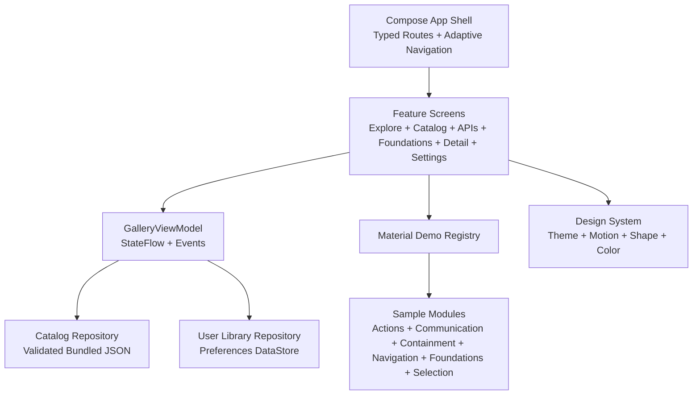

# Material Design - Developer Documentation

> Architecture, implementation notes, conventions, and verification guidance for Material Design development.

**Version Source:** `material-app/gradle.properties` | **Last Updated:** 2026-08-30
**Scope:** Android reference app, catalog architecture, UI paradigms, web surfaces, testing, and release maintenance.

---

## Table of Contents

- [Architecture Overview](#architecture-overview)
- [Technology Stack](#technology-stack)
- [Project Structure](#project-structure)
- [Runtime Flow](#runtime-flow)
- [Core Concepts](#core-concepts)
- [Navigation & State](#navigation--state)
- [Catalog & Search](#catalog--search)
- [UI & Design System](#ui--design-system)
- [Feature Modules Deep Dive](#feature-modules-deep-dive)
- [Naming Conventions](#naming-conventions)
- [Configuration](#configuration)
- [Security & Privacy Practices](#security--privacy-practices)
- [Error Handling](#error-handling)
- [Testing Suite](#testing-suite)
- [Build & Release Engineering](#build--release-engineering)
- [Intended Changes & Anomalies](#intended-changes--anomalies)
- [Project Auditing & Quality Standards](#project-auditing--quality-standards)
- [Troubleshooting](#troubleshooting)
- [Maintenance Notes](#maintenance-notes)
- [Feedback](#feedback)

---

## Architecture Overview

Material Design is an Android-led multi-surface reference project. The Android application uses a modular architecture with a small composition root, focused core modules, feature-owned product screens, and sample modules grouped by official Material domains.



### Key Architectural Decisions

| Decision | Rationale |
|----------|-----------|
| **Android-led reference** | The executable Compose gallery establishes accepted behavior before independent web implementations translate the same design intent. |
| **Multi-module Gradle architecture** | App, core, feature, and sample ownership remains explicit and independently verifiable. |
| **Validated offline catalog** | Installed references never depend on a backend and cannot drift silently from demos, sources, guidance, or pinned artifacts. |
| **Typed navigation** | Kotlin Serialization route objects replace raw route strings and keep route arguments explicit. |
| **Isolated state flows** | Search, filters, destinations, catalog data, preferences, and events update independently. |
| **State-hoisted samples** | Demonstrations expose reusable state and callbacks where useful instead of hiding behavior in monolithic screens. |
| **Local-first privacy** | The Android manifest has no internet permission and user preferences remain in local DataStore. |
| **Independent web implementations** | Android and web share UI/UX goals without sharing code, APIs, tokens, state, or release schedules. |

## Technology Stack

| Area | Technology |
|------|------------|
| Language and toolchain | Kotlin, JVM 11 bytecode, Gradle Kotlin DSL, Android Gradle Plugin, convention plugins |
| Android platform | compileSdk 37, targetSdk 37, minSdk 24, AndroidX Core, Lifecycle, Activity |
| UI | Jetpack Compose, Material 3 Expressive, Material 3 Adaptive, Material icons |
| State and architecture | ViewModel, StateFlow, SharedFlow, Kotlin Coroutines |
| Navigation | Navigation Compose with Kotlin Serialization typed routes |
| Persistence | Preferences DataStore |
| Catalog | Kotlin Serialization and bundled JSON assets |
| Tests | JUnit 4, AndroidX Test, Espresso, Compose UI tests, Gradle TestKit |
| Web | Semantic HTML, responsive CSS, vanilla JavaScript, GitHub Pages |

Dependency versions are centralized in `material-app/gradle/libs.versions.toml`. Application version name and code are centralized in `material-app/gradle.properties`.

---

## Project Structure

```text
material-design/
├── .agents/
│   ├── AGENTS.md                                # Repository guide for humans and coding agents
│   └── skills/                                  # Markdown skills for agents and harnesses
├── material-app/
│   ├── build-logic/convention/                  # Android, Compose, serialization, and verification plugins
│   ├── app/                                     # Activity, composition root, typed graph, adaptive shell
│   ├── core/
│   │   ├── catalog/                             # Models, bundled JSON, validation, search repository
│   │   ├── data/                                # DataStore preferences and user library repository
│   │   └── designsystem/                        # Theme, expressive motion, color, and shared design behavior
│   ├── feature/
│   │   ├── explore/                             # Featured, bookmarked, and recent references
│   │   ├── catalog/                             # Component browsing and category filters
│   │   ├── apis/                                # Stable and experimental API browsing
│   │   ├── foundations/                         # Color, shape, motion, elevation, layout, accessibility
│   │   ├── detail/                              # Preview, guidance, inspect, and API tabs
│   │   └── settings/                            # Appearance, personalization, About
│   └── samples/
│       ├── actions/                             # Buttons, FABs, button groups, toolbars
│       ├── communication/                       # Dialogs, sheets, snackbars, tooltips, menus
│       ├── containment/                         # Cards, lists, refresh, carousels, dismissible content
│       ├── navigation/                          # Bars, rails, drawers, tabs, app bars
│       ├── foundations/                         # Foundation demonstrations
│       └── selection/                           # Pickers, sliders, text input, search
├── docs/                                        # Complete GitHub Pages publishing root
│   ├── material-web-legacy/                     # Stable responsive framework-free showcase
│   ├── projects/                                # Published project documentation
│   └── skills/                                  # Browsable HTML Android and web guidance
├── material-web/                                # Independent Material Web workspace
├── CHANGELOG.md                                 # Complete engineering history
├── DEVELOPMENT.md                               # Architecture and developer guide
├── LICENSE.md                                   # MIT license
├── PRIVACY.md                                   # App and website privacy behavior
├── RELEASES.md                                  # Public release notes beginning with the first release
├── TASKS.md                                     # Active work and tracked gaps
└── README.md                                    # Main project entry point
```

---

## Runtime Flow

1. **Activity startup:** `MainActivity` creates the application container and enters the Compose root.
2. **Dependency composition:** `MaterialAppContainer` provides the bundled catalog loader and DataStore-backed user library repository.
3. **Catalog loading:** `GalleryViewModel` loads and validates the bundled catalog on the injected I/O dispatcher.
4. **State publication:** The ViewModel exposes catalog, search, destination, filter, preference, library, and event flows.
5. **Adaptive shell:** `GalleryShell` selects compact or expanded navigation from the current window size class.
6. **Feature routing:** Explore, Catalog, APIs, and Foundations render from immutable state and callbacks.
7. **Detail resolution:** Typed detail routes resolve a stable catalog ID and connect its preview to `MaterialDemoRegistry`.
8. **Local persistence:** Bookmarks, recent IDs, theme, accent, and motion settings persist through Preferences DataStore.

---

## Core Concepts

### Catalog Identity

Every installed reference has a stable ID, official name, aliases, kind, category, demo key, source locations, API references, official URLs, implementation classification, and review date. IDs and demo keys are compatibility contracts; do not rename them casually.

### API Classification

The catalog records two separate dimensions:

- **Availability:** Whether an API exists in a stable artifact or only on an alpha line.
- **Stability:** Whether the individual API is stable or requires an experimental opt-in.

Do not infer one dimension from the other.

### Platform Parity

Android, the published documentation, the stable browser showcase, and the independent Material Web workspace share appearance, terminology, interaction purpose, states, accessibility intent, and adaptive behavior. They remain separate implementations.

### Product-Surface Contract

The application shell and documentation surfaces must use Material Design as complete products. Navigation, search, ordinary actions, typography, loading, empty and error states, motion, and settings are part of the reference, not neutral containers around demos.

---

## Navigation & State

`MaterialGalleryApp.kt` owns the typed navigation graph. The app module maps routes and composes feature modules; feature and sample modules do not depend on the app module or receive a navigation controller.

`GalleryViewModel` owns application-level state:

- Catalog load state is loading, ready, or failed with retry.
- Query text is emitted immediately so typing never waits for debounced search work.
- Search results and visible catalog entries are derived off the main thread.
- Root destination, selected category, and API stability are isolated flows.
- Library and appearance state come from `UserLibraryRepository`.
- One-shot failures use a bounded shared event flow and app-level snackbar host.

Collect state at the narrowest owning composable and pass immutable values plus callbacks downward.

---

## Catalog & Search

`BundledCatalogRepository` parses `core/catalog/src/main/assets/catalog/catalog.json`, validates document versions, and provides deterministic entry lookup and search.

Catalog tests require:

- Exact alignment between reviewed catalog versions and pinned dependency metadata.
- Unique stable IDs and canonical names.
- Registered demos for working entries.
- Existing source files and declared symbols.
- Complete purpose, use, avoid, behavior, accessibility, and adaptive guidance.
- Valid official URLs, implementation classifications, and API metadata.

Search includes official names, aliases, summaries, categories, guidance, and API symbols. Keep normalization deterministic and avoid UI-thread indexing.

---

## UI & Design System

### Theme and Personalization

`MaterialDesignTheme` applies system, light, dark, and OLED modes plus dynamic or selected accent palettes. Theme values come from `ThemeState`; feature modules must not invent independent app themes.

### Expressive Motion

Project motion values live in `core/designsystem/ExpressiveMotion.kt`. Reduced motion replaces decorative spatial and opacity effects with snap behavior while preserving interaction meaning and safety timing.

Animation must tolerate interruption, repeated input, disposal, disabled-state changes, and zero duration without stale jobs or transformed content.

### Adaptive Layout

Use current window size information, not device names or fixed orientation assumptions. Verify phones, tablets, foldables, freeform windows, browser zoom, increased font scale, and long translated text.

### Accessibility

Preserve semantic labels, touch targets, focus order, contrast, state announcements, meaningful content descriptions, and keyboard interaction. Decorative icons use null descriptions.

---

## Feature Modules Deep Dive

### 1. Explore (`feature/explore`)

Featured references, recent history, bookmarks, category entry points, and discovery surfaces.

### 2. Catalog (`feature/catalog`)

Component browsing, category filtering, counts, and entry cards.

### 3. APIs (`feature/apis`)

Stable and experimental API views derived from reviewed catalog references.

### 4. Foundations (`feature/foundations`)

Inspectable Color, Shape, Motion, Elevation, Layout, and Accessibility references.

### 5. Detail (`feature/detail`)

Preview, Guidance, Inspect, and API tabs with collapsible header behavior and source/API copy actions.

### 6. Settings (`feature/settings`)

Theme modes, OLED, dynamic color, accent selection, reduced motion, library clearing, and About information.

### 7. Samples (`samples/*`)

Copyable state-hoisted implementations grouped by official Material domain. Samples may contain educational display text, but production app and feature strings belong in resources.

---

## Naming Conventions

### Directory & File Names

- **Compose screens:** PascalCase with `Screen` suffix, such as `SettingsScreen.kt`.
- **Samples:** PascalCase domain files with exported composables ending in `Sample` where appropriate.
- **ViewModels:** PascalCase with `ViewModel` suffix.
- **Repositories:** PascalCase with `Repository` suffix.
- **Routes:** PascalCase serializable objects or data classes with `Route` suffix.
- **Resources:** Lowercase snake case with a module-specific prefix.

### Method Signatures

| Prefix | Intent | Example |
|--------|--------|---------|
| `load` | Read initial data | `loadCatalog()` |
| `select` | Choose navigation or filter state | `selectCategory(category)` |
| `update` | Replace persistent or mutable state | `updateQuery(query)` |
| `set` | Apply an explicit value | `setBookmarked(id, bookmarked)` |
| `clear` | Remove retained state | `clearRecent()` |
| `remember` | Create Compose-retained state | `rememberSearchBarState()` |
| `is` / `has` | Boolean checks | `isCompact`, `hasSigningConfig` |

---

## Configuration

### Compilation Metrics

| Attribute | Configuration Source |
|-----------|----------------------|
| Namespace and application ID | `material-app/app/build.gradle.kts` |
| Compile and minimum SDK | `material-app/build-logic/convention/src/main/kotlin/AndroidCommon.kt` |
| Target SDK | `material-app/app/build.gradle.kts` |
| Version name and code | `material-app/gradle.properties` |
| Java and Kotlin target | Android convention plugin |
| Gradle version | `material-app/gradle/wrapper/gradle-wrapper.properties` |
| Dependency versions | `material-app/gradle/libs.versions.toml` |

### Build Types

- **Debug:** Adds `.debug` to the application ID, appends `-debug` to the version name, and uses the `Material Design Debug` label.
- **Release:** Uses R8 optimization and resource shrinking, the production label, and optional local signing configuration.

### Manifest Declarations

The Android app declares its launcher activity, backup rules, application label, icons, and theme. It intentionally declares no permissions, including no internet permission.

---

## Security & Privacy Practices

1. **No network permission:** The Android app cannot directly upload catalog use, settings, or activity data.
2. **No trackers:** Do not add analytics, advertising, telemetry, account, or tracking SDKs.
3. **Local preferences:** Bookmarks, recents, and appearance settings remain in Preferences DataStore.
4. **Backup exclusion:** Keep `material_reference.preferences_pb` excluded from cloud backup and device transfer in both Android rule formats.
5. **User-initiated links:** Official documentation opens only after a user action through Android intent resolution.
6. **Secret isolation:** Never commit signing properties, keystores, passwords, SDK paths, or generated artifacts.
7. **Website storage:** Browser local storage may retain interface preferences only. Any analytics change requires explicit approval and a privacy-policy update.

See [PRIVACY.md](PRIVACY.md) for the user-facing policy.

---

## Error Handling

- **Catalog loading:** Preserve loading, ready, and failed states with a visible retry path.
- **Cancellation:** Catch and rethrow `CancellationException` before handling ordinary failures.
- **Repository writes:** Surface bookmark, history, and settings failures through one-shot app events.
- **Missing demos:** Treat catalog-to-registry mismatches as test failures and show a controlled unavailable state at runtime.
- **External links:** Resolve intents safely and avoid crashing when no compatible handler exists.

```kotlin
try {
    executeWork()
} catch (cancellation: CancellationException) {
    throw cancellation
} catch (throwable: Throwable) {
    handleFailure(throwable)
}
```

---

## Testing Suite

Material Design uses JVM unit, build-logic TestKit, and instrumented Compose UI tests.

### Test Distribution

- **App tests:** ViewModel search and state, demo registration, backup policies, and typed navigation UI.
- **Catalog tests:** Parsing, versions, identities, sources, demos, guidance, and official metadata.
- **Data tests:** Bookmark, recent-history, and settings persistence behavior.
- **Design-system tests:** Expressive motion and reduced-motion behavior.
- **Build-logic tests:** Production string detection and release metadata verification.
- **Instrumented tests:** Device-dependent gallery navigation and Compose interaction.

### Verification Commands

Run from `material-app/` and use `gradlew.bat` on Windows.

```powershell
# All Android JVM tests
.\gradlew.bat testDebugUnitTest

# Build-logic TestKit coverage
.\gradlew.bat -p build-logic :convention:test

# Release-oriented non-device verification
.\gradlew.bat :app:lintDebug checkProductionStrings verifyMaterialBuildConventions

# Complete release gate
.\gradlew.bat testDebugUnitTest :app:lintDebug :app:assembleDebug :app:assembleRelease

# App instrumented UI tests
.\gradlew.bat :app:connectedDebugAndroidTest
```

Run affected module tests while iterating. Reserve complete lint and APK builds for release milestones or cross-module changes.

---

## Build & Release Engineering

Run commands from `material-app/` with Android SDK 37 installed.

```powershell
# Configure and verify the wrapper/toolchain
.\gradlew.bat help

# Generate the debug APK
.\gradlew.bat :app:assembleDebug

# Run release checks
.\gradlew.bat testDebugUnitTest :app:lintDebug checkProductionStrings verifyMaterialBuildConventions

# Generate the optimized release APK
.\gradlew.bat :app:assembleRelease
```

Release signing reads ignored `signing.properties`, with `local.properties` as a fallback:

```properties
signing.storeFile=C:/absolute/path/to/keystore.jks
signing.storePassword=your_store_password
signing.keyAlias=your_key_alias
signing.keyPassword=your_key_password
```

Never commit signing credentials or keystores.

### APK Naming Standards

- **Debug:** `app/build/outputs/apk/debug/Material Design-<version>-Debug.apk`
- **Release:** `app/build/outputs/apk/release/Material Design-<version>.apk`

Version name comes from `appVersionName`. Derive `appVersionCode` by removing dots from the requested version, such as `1.2.3` to `123`.

Before publishing, align the build version, CHANGELOG, RELEASES, final diff, verification results, and fresh artifacts. `RELEASES.md` begins with the first public release; `CHANGELOG.md` retains the full engineering history.

---

## Intended Changes & Anomalies

| Aspect | Deliberate Behavior | Design Rationale |
|--------|---------------------|------------------|
| **No network access** | The Android app declares no internet permission. | Keeps the reference gallery and local preferences offline. |
| **Independent web schedules** | The stable showcase and Material Web workspace do not share the Android release number. | Preserves platform-specific implementation and release ownership. |
| **Alpha Material APIs** | Selected references pin explicit alpha artifacts and opt-ins. | Allows review of current Material 3 Expressive APIs while clearly labeling stability. |
| **Educational sample text** | Sample modules can contain inline demonstration labels. | Keeps copyable examples self-contained while production feature text remains resource-backed. |

---

## Project Auditing & Quality Standards

When reviewing changes, ensure:

1. **Scope compliance:** Changes stay inside the correct app, core, feature, sample, documentation, or web boundary.
2. **Catalog integrity:** IDs, names, aliases, demos, sources, versions, guidance, URLs, and stability metadata remain valid.
3. **Module independence:** Core, feature, and sample modules never depend on the app module; web implementations remain independent.
4. **State ownership:** Mutable state has one clear owner and UI receives immutable values plus callbacks.
5. **Responsive behavior:** Compact, expanded, resized, high-font-scale, and long-text layouts avoid clipping and infinite constraints.
6. **Accessibility:** Semantics, focus, touch targets, contrast, content descriptions, and reduced motion remain correct.
7. **Resource discipline:** Production app and feature UI strings use resources and pass `checkProductionStrings`.
8. **Focused verification:** Run affected tests during implementation and complete release gates at milestones.
9. **Documentation alignment:** Markdown skills and published HTML counterparts stay synchronized.
10. **Release integrity:** Versions change only when requested and user-visible work is recorded in the changelog.

---

## Troubleshooting

- **Android SDK not found:** Set `sdk.dir` in ignored `material-app/local.properties` or configure the Android SDK environment.
- **Catalog version drift:** Align the version catalog, `BundledCatalogRepository`, and `catalog.json`.
- **Missing demo:** Confirm the catalog `demoKey` exists in `MaterialDemoRegistry`.
- **Configuration cache issue:** Rerun once after build-logic changes; use `--no-configuration-cache` only for diagnosis.
- **Unsigned release:** Provide all four local signing properties before `:app:assembleRelease`.
- **Compose alpha migration failure:** Inspect the resolved source artifact and compiler replacement signature.
- **Broken local documentation route:** Serve from `docs/` so paths match GitHub Pages.
- **Windows line-ending notices:** Review the diff for real churn; LF-to-CRLF messages alone are workspace notices.

---

## Maintenance Notes

- **Changelog:** Update the current changelog section for every completed user-visible change.
- **Version alignment:** Keep build versions in `gradle.properties`; do not duplicate current versions in evergreen docs or badges.
- **Catalog history:** Preserve stable IDs, historical `addedIn` values, and prior release entries.
- **Dependency upgrades:** Update catalog metadata, docs, migrations, and tests with every pinned dependency change.
- **Skills parity:** Keep `.agents/skills` Markdown skills aligned with their published HTML versions.
- **Release notes:** Keep RELEASES concise and user-facing; keep detailed engineering history in CHANGELOG.
- **Unfinished work:** Track incomplete components in TASKS rather than adding placeholder catalog entries.

---

## Feedback

Material Design is a personal project. To report bugs, request references, or suggest documentation and accessibility improvements, open an issue on the [GitHub issue tracker](https://github.com/qtremors/material-design/issues).

---

<p align="center">
  <a href="README.md">Back to README</a>
</p>
