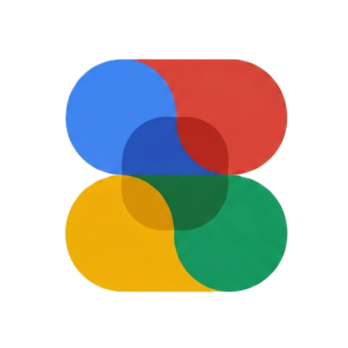

<p align="center">
  
</p>

<h1 align="center"><a href="https://qtremors.github.io/material-design/">Material Design</a></h1>

<p align="center">
  An active Android component gallery, a frozen responsive web showcase, and Material Design 3 guidance built for people, LLMs, and coding agents.
</p>

<p align="center">
  
  
  
</p>

> [!NOTE]
> **Personal Project** 🎯
> Put bluntly: even after Material 3 Expressive has been available for over a year, LLMs still struggle to design and implement it well. They can reproduce isolated components, but often miss the UI/UX judgment, animation, motion, physics, hierarchy, adaptation, and creativity that make an interface actually feel Material.
>
> This repository is my attempt to improve that. It gives humans, LLMs, and coding agents working, inspectable Material 3 Expressive references instead of relying on vague prompts or disconnected screenshots. Android now leads the evolving implementation, while the documentation explains the design reasoning behind it.
>
> ℹ️ This independent educational project is heavily based on **[Google Material Design](https://m3.material.io/)**.

## Why This Exists

Material 3 Expressive is not just a collection of rounded components. Good results depend on how color, typography, shape, hierarchy, state, interaction, responsive layout, animation, spring physics, accessibility, and product context work together. Those relationships are exactly where generated interfaces usually become generic or incorrect.

The goal is to make this repository a concrete reference an agent can inspect: find an officially named component, experience its real behavior in the Android app, read its Kotlin/Jetpack Compose implementation, verify the reviewed API metadata, and adapt the pattern without pretending project experiments are official Material APIs.

## Live Documentation and Showcase

- **➡️ [Android APK releases](https://github.com/qtremors/material-design/releases)**
- **➡️ [Frozen legacy web showcase](https://qtremors.github.io/material-design/material-web-legacy/)**
- **➡️ [Live web documentation and Material 3 Expressive guidance](https://qtremors.github.io/material-design/)**

---

## 🧭 Projects

| Project | Purpose | Status |
|---------|---------|--------|
| [`material-app/`](material-app/) | Searchable Material Design gallery and modular Compose source reference | 2.0.1, active |
| [`docs/material-web-legacy/`](https://qtremors.github.io/material-design/material-web-legacy/) | Current browser showcase and original framework-free implementation | Frozen at 1.5.0 |
| [`material-web/`](material-web/) | Future independent vanilla HTML/CSS/JS implementation | Future |
| [`docs/`](https://qtremors.github.io/material-design/) | Responsive documentation and Material 3 Expressive learning site | Active |
| [`docs/skills/`](https://qtremors.github.io/material-design/#skills) | HTML guidance for Android and web development | Active |

Android and web share UI/UX intent—appearance, states, terminology, interaction purpose, and adaptive behaviour—but never implementation code, tokens, APIs, state management, or release schedules.

### Platform Versions and Releases

| Surface | Version | Public entry point |
|---------|---------|--------------------|
| Android app | 2.0.1, WIP | [APK releases](https://github.com/qtremors/material-design/releases) |
| Web documentation | 2.0.1 | [Live documentation](https://qtremors.github.io/material-design/) |
| Legacy web showcase | 1.5.0, frozen | [Live legacy showcase](https://qtremors.github.io/material-design/material-web-legacy/) |
| Future Material Web | Future | [Project route](https://qtremors.github.io/material-design/material-web/) |

---

## ✨ Android Reference App

The Android app is a living component gallery rather than a course or code browser. Search official names and aliases, interact with working variants and states, inspect stable versus experimental Compose APIs, and copy repository-relative source paths for agents or developers.

Current working references include Buttons, Button groups, Toggle buttons, Split buttons, Floating action buttons, Progress indicators, Cards, Lists, Segmented list items, Carousels, Chips, Segmented buttons, Selection controls, Floating toolbars, and Typography. Each catalog entry includes searchable purpose, use and avoid rules, behavior, accessibility, adaptive guidance, reviewed API metadata, and source locations. The adaptive shell provides Explore, Catalog, APIs, and Foundations destinations plus local bookmarks, recent history, theme, dynamic-color, and reduced-motion settings.

## ✨ Legacy Web Features

The original showcase retains the features below unchanged, while the Android app develops the next Material Design component references.

| Feature | Description |
|---------|-------------|
| 🎨 **Theme Engine** | Dynamic Light/Dark mode and color seed generation (Blue, Purple, Green, etc.). |
| 🌊 **Ripple Effect** | Custom JavaScript implementation of the material ripple interaction. |
| 🧩 **Components** | Buttons, Cards, Inputs, Dialogs, Sheets, Chips, and more. |
| 🧭 **Navigation** | Responsive Navigation Rail and Drawer injected dynamically. |
| 🧪 **Playground** | Built-in inspection tool to visualize all 300+ design tokens. |
| ⚡ **Zero Deps** | No build tools, no frameworks, just pure web technologies. |

---


## 🚀 Quick Start

```bash
# Clone and navigate
git clone https://github.com/qtremors/material-design.git
cd material-design

# Run the GitHub Pages tree locally
# You need a live server to handle modules and CORS properly.
cd docs
# Options:
# 1. VS Code "Live Server" extension
# 2. Python: python -m http.server
# 3. Node: npx serve
# 4. PHP: php -S localhost:8000
```

Run the server from `docs/`, then visit **http://localhost:8000/** for documentation or **http://localhost:8000/material-web-legacy/** for the original showcase.

Build and verify Android separately:

```powershell
cd material-app
.\gradlew.bat testDebugUnitTest assembleDebug
```

---

## 🛠️ Tech Stack

| Layer | Technology |
|-------|------------|
| **Android** | Kotlin, Jetpack Compose, Material 3 Expressive and Adaptive |
| **Current/Future Web** | HTML5, CSS custom properties, Vanilla JavaScript (ES6+) |
| **Fonts** | Roboto, Roboto Flex, Material Symbols |
| **Documentation** | Responsive static HTML and CSS |

---

## 📁 Project Structure

```
material-design/
├── docs/                 # Complete GitHub Pages publishing root
│   ├── assets/           # Shared web branding and media
│   ├── material-web-legacy/
│   │   └── src/          # Frozen component pages, CSS, JS, and widgets
│   ├── projects/         # Android and web project documentation
│   └── skills/
│       ├── android/      # Android HTML skills
│       └── web/          # Web HTML skills
├── material-app/         # Modular Android component gallery and source reference
├── material-web/         # Future independent web implementation
├── DEVELOPMENT.md        # Developer documentation
├── CHANGELOG.md          # Version history
├── TASKS.md              # Task tracking
├── LICENSE               # MIT license
└── README.md
```

---

## 📚 Documentation

| Document | Description |
|----------|-------------|
| [DEVELOPMENT.md](DEVELOPMENT.md) | Architecture, setup, API reference |
| [CHANGELOG.md](CHANGELOG.md) | Version history and release notes |
| [TASKS.md](TASKS.md) | Task tracking and roadmap |
| [Documentation hub](https://qtremors.github.io/material-design/) | Browser-readable Material Design learning guide |
| [Complete site map](https://qtremors.github.io/material-design/site-map.html) | Every page published through the GitHub Pages website |
| [Component parity](https://qtremors.github.io/material-design/parity.html) | Android readiness and future web status |
| [HTML skills](https://qtremors.github.io/material-design/#skills) | Direct Android and web development references |

---

<p align="center">
  Made with ❤️ by <a href="https://github.com/qtremors">Tremors</a>
</p>

## License

MIT — see [LICENSE](LICENSE).
